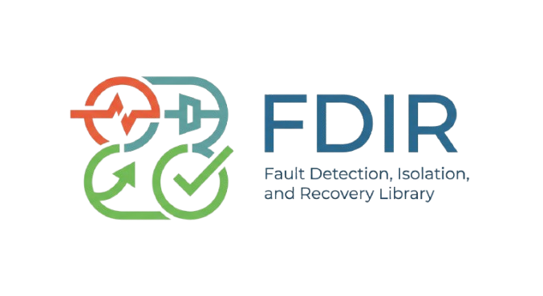
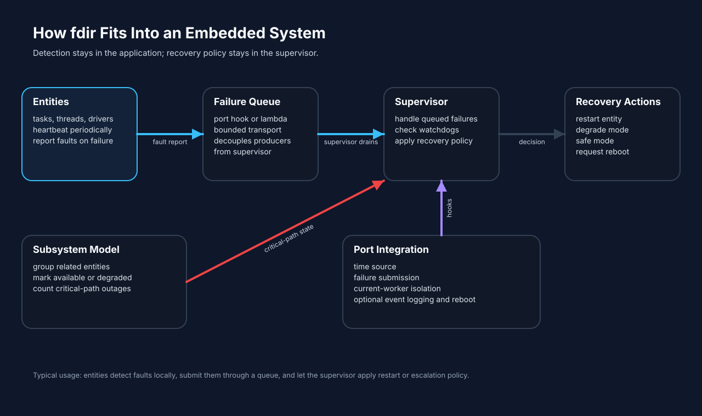
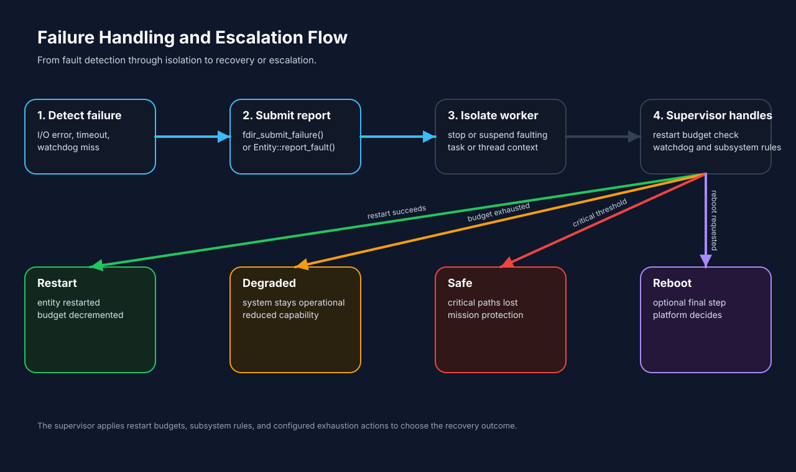
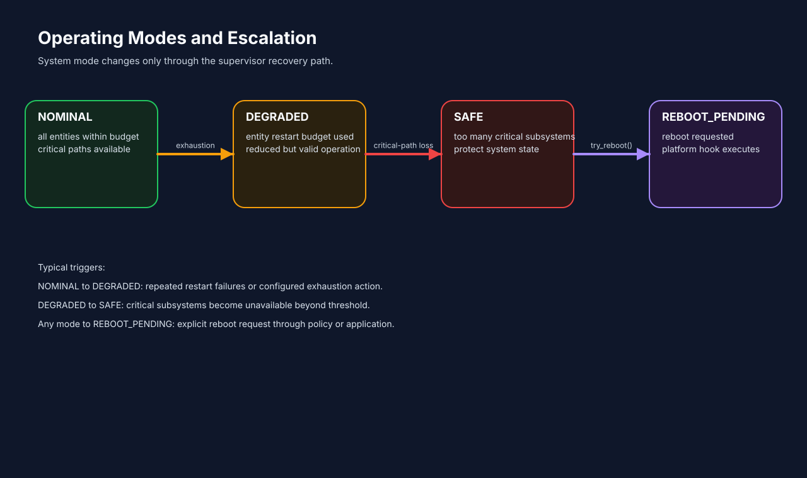

<p align="center">
  <picture>
    <source media="(prefers-color-scheme: dark)" srcset="docs/assets/logo-light.png">
    
  </picture>
</p>

<p align="center">
  <b>FDIR: Fault Detection, Isolation & Recovery library</b>
</p>

<p align="center">
  <a href="https://github.com/mathijs-follon/fdir/releases/latest"></a>
  <a href="https://github.com/mathijs-follon/fdir/actions/workflows/compile-and-test.yml"></a>
  
  
  
  
  
</p>


> Looking for the API? [click here](docs/api.md) 

Portable C11 FDIR (Fault Detection, Isolation and Recovery) library for embedded and RTOS applications.

FDIR is a fault-management pattern used in spacecraft, aviation, and safety-critical embedded systems. When a software component fails, the system detects the fault, isolates the affected entity, and applies a configurable recovery action: restart, degradation, safe mode, or reboot. `fdir` provides a small, deterministic framework for this behaviour.

The library is inspired by FDIR modules written for CubeSat RTOS projects at university. Reimplementing the same patterns from scratch for each project is impractical, so the common parts were extracted into this reusable library.

The core library uses no dynamic allocation and has no operating-system dependency. Platform-specific behaviour is provided through a small set of port hooks.

## Design

The following properties are addressed by the design:

- explicit fault detection and fault reporting
- separation between fault detection and recovery decisions
- deterministic recovery policies
- watchdog and heartbeat supervision
- bounded restart attempts
- explicit degraded and safe operating modes
- isolation of affected software entities
- subsystem-level escalation
- explicit platform integration points
- no dynamic memory allocation in the core
- testable recovery behaviour
- portability across embedded and RTOS environments

## Standards awareness

`fdir` is developed with safety- and mission-critical engineering practices in mind. The design addresses engineering concerns commonly encountered in dependable embedded and space software.

The project does not claim compliance or certification against any standard such as ECSS-E-ST-40C, ECSS-Q-ST-80C, or IEC 61508.

Whether these properties contribute to compliance with a particular standard depends on the applicable requirements, project tailoring, implementation, and verification evidence.

Integrators should read [docs/integration.md](docs/integration.md) (recommended wiring), [docs/safety/seooC.md](docs/safety/seooC.md) (assumptions and limits), and [docs/threading.md](docs/threading.md) (concurrency contract).

The project may be used as a software component within systems developed under standards such as ECSS-E-ST-40C, ECSS-Q-ST-80C, or IEC 61508, but using it does not by itself constitute compliance with those standards.

## Concepts





> <sub> *Images generated by AI* </sub>

**Entity:** a task, thread, or software component registered with the framework. Each entity has a restart budget and a watchdog heartbeat. When a fault is reported fdir selects a recovery action (restart, degrade, safe mode, reboot) based on the entity's descriptor and the current system state.

**Subsystem:** a logical grouping of entities that can be marked available, degraded, or unavailable. Critical-path subsystems participate in the safe-mode threshold check.

**Mode:** the global operating mode, driven only by the supervisor recovery path:

| Mode | Value | Meaning |
|------|-------|---------|
| NOMINAL | 0 | All entities within budget |
| DEGRADED | 1 | At least one entity exhausted its restart budget |
| SAFE | 2 | Too many critical subsystems unavailable |
| REBOOT_PENDING | 3 | Reboot has been requested |


> <sub> *Image generated by AI* </sub>

## Building

```
make          # build libfdir.a and compile_commands.json
make test     # build and run all tests
make examples # build all four example binaries
make clean
```

## Examples

Each example lives under `examples/<name>/` and registers a `fdir_port_t` at `fdir_init()`.

### getting_started

Minimal example with no RTOS and no threads. Covers fault/restart, budget exhaustion, and watchdog detection.

```
make getting_started
./build/getting_started
```

### dual_path

Satellite-style dual critical-path example with per-entity `decide()` policy. Covers link-loss degrade-only, init-fail unavailable, and SAFE escalation.

```
make dual_path
./build/dual_path
```

See [docs/integration.md](docs/integration.md) for the full integration guide.

### filecopy

Parallel directory copy CLI. Worker threads share a bounded job queue and heartbeat fdir after each file. Demonstrates multi-entity registration and fault-driven restart/degrade on I/O errors.

```
make filecopy
./build/fcopy <src> <dst> [--workers N]
```

### FreeRTOS

FreeRTOS integration on the POSIX/Linux simulator. Three tasks (worker, supervisor, scenario driver) drive watchdog miss, budget exhaustion, and dual-path SAFE mode.

```
git submodule update --init examples/FreeRTOS/FreeRTOS-Kernel

make freertos
./build/example_FreeRTOS
```

## Questions and support

If you have questions about integrating the library, run into unexpected behaviour, or want to discuss how to apply it to your system, open an issue on GitHub. I am happy to help.

## Changelog

Release notes: [docs/changenotes/v1.0.2.md](docs/changenotes/v1.0.2.md)

| Version | Notes |
|---------|-------|
| [v1.0.2](docs/changenotes/v1.0.2.md) | Fix entity-register nested lock and unsynchronised mode mutators |
| [v1.0.1](docs/changenotes/v1.0.1.md) | Fix restart-on-exhausted recursion (#1) and report_fault TOCTOU (#2) |
| [v1.0.0](docs/changenotes/v1.0.0.md) | First stable C-only API; explicit port, internal failure queue, cooperative workers |
| [v0.2.0](docs/changenotes/v0.2.0.md) | `fdir_post_failure` renamed to `fdir_submit_failure` |
| [v0.1.0](docs/changenotes/v0.1.0.md) | Initial release |

## API reference

Full API reference including integration examples and port hook documentation: [docs/api.md](docs/api.md).

## AI usage

AI assistants were used to help write documentation and produce the static SVG figures and the logo images in `docs/assets/`. The library source, tests, and examples were written and reviewed by me. AI was not used to generate the implementation wholesale, but it did help substantially with debugging and with shaping the examples, the `Makefile`, and the overall project structure. The library abstracts fault-handling patterns common in embedded and space software.
